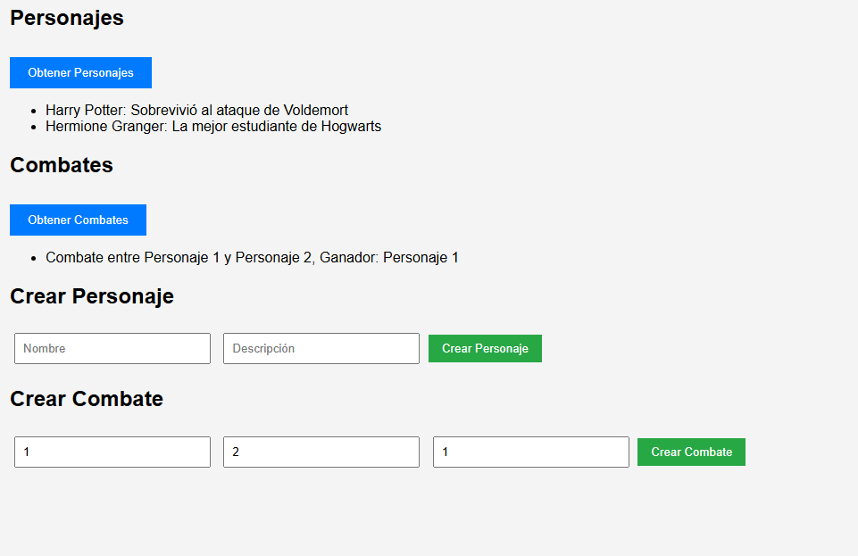

# HarryPotterInf2

# Proyecto HarryPotterInf2

Este proyecto es una API RESTful construida con Node.js y MySQL. Permite gestionar personajes y combates en un universo de Harry Potter. El proyecto sigue una arquitectura **MVC** (Modelo-Vista-Controlador) y utiliza una base de datos MySQL para almacenar la información.

## Estructura del Proyecto

La estructura de carpetas del proyecto es la siguiente:

```
├── config/ # Configuración de la base de datos y variables de entorno
│ └── db.js # Configuración de la conexión a la base de datos MySQL
├── routes/ # Están los controladores 
│ ├── charactersRoutes.js # Rutas para gestionar personajes
│ ├── peliculasRoutes.js # Rutas para gestionar películas
│ └── combatesRoutes.js # Rutas para gestionar combates
├── public/ # Todo lo relacionado a la vista
│ ├── index.html 
│ ├── style.css
│ └── script.js
├── utils/ # Utilidades y funciones auxiliares
│ └── img.png # Captura de pantalla de la API
├── index.js # Archivo principal para iniciar el servidor
├── package.json # Dependencias y scripts del proyecto
└── README.md # Documentación del proyecto
```

## Herramientas Utilizadas

- **Node.js**: Entorno de ejecución para JavaScript en el backend.
- **Express.js**: Framework web para Node.js, utilizado para crear la API RESTful.
- **MySQL**: Sistema de gestión de bases de datos relacional utilizado para almacenar los datos.
- **Body-Parser**: Middleware para procesar los cuerpos de las solicitudes HTTP.
- **CORS**: Middleware que permite solicitudes de otros orígenes (para facilitar el desarrollo).
- **Express-Bearer-Token**: Middleware para manejar la autenticación con JWT.
- **Router**: Utilizado para definir las rutas y controladores de la API RESTful.
- **Postman**: Herramienta para probar las API RESTful.

## Instalación

1. Clona el repositorio en tu máquina local:

   ```bash
   git clone https://github.com/Oyupa/HarryPotterInf2.git
   cd HarryPotterInf2
   ```
2. Instala las dependencias del proyecto:

   ```bash
    npm install
   ```
3. Configura la base de datos MySQL en el archivo `config/db.js` con tus credenciales. Asegúrate de crear la base de datos y las tablas necesarias antes de ejecutar el proyecto.
   Este proyecto usa 5 tablas aunque no todas están implementadas en la lógica. Las tablas son:

   1. combates
   2. personajes
   3. peliculas
   4. peliculas_personajes #Posible implementación futura
   5. usuarios #Posible implementación futura de un sistema de autenticación
4. Inicia el servidor (estará disponible en `http://localhost:3000`):

   ```bash
   npm start
   ```

Capturas:

